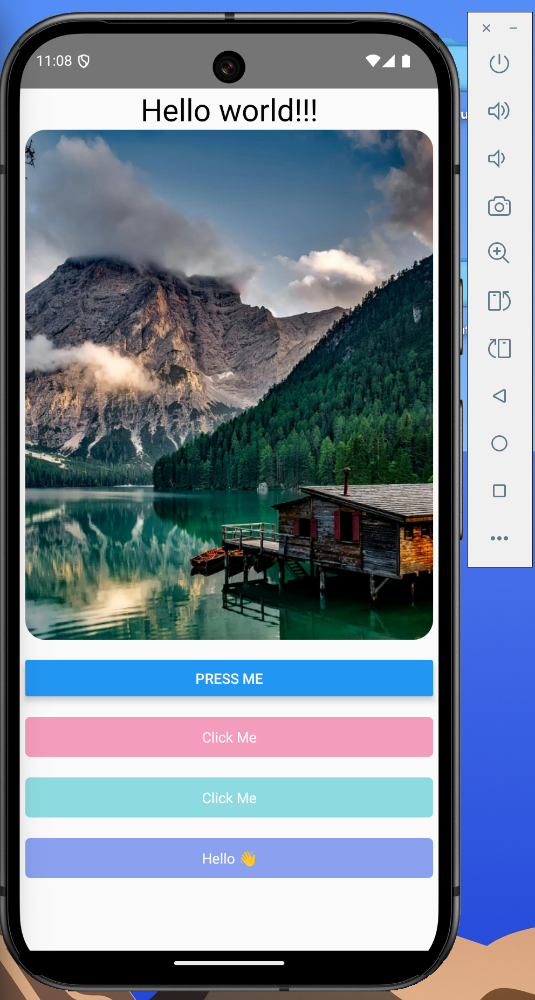

# Fundamental Concepts Notes : 

#### App.tsx
```tsx
import {View, Text, Image, Button, TouchableOpacity, Alert, TouchableHighlight, Pressable} from 'react-native';
import React from 'react';

const App = () => {
  return (
    // View component is just like "div" in html
    <View style={{marginHorizontal: 'auto'}}>
      {/* Text Component : To add text */}
      <Text style={{textAlign: 'center', fontSize: 30}}>Hello world!!!</Text>

      {/* Image component is used to add images */}
      <Image
        source={{
          uri: 'https://images.pexels.com/photos/147411/italy-mountains-dawn-daybreak-147411.jpeg',
        }}
        style={{height: 500, width: 400, borderRadius: 20, marginBottom: 20}}
      />

      {/* 3 Ways of adding buttons to our application. */}

      {/* Way 1 : Normal button with no customization option. */}
      <Button title="Press Me"></Button>

      {/* Way 2 : Touchabel */}

      {/* TouchableOpaity */}
      <TouchableOpacity
        style={{
          marginTop: 20,
          backgroundColor: '#F49CBB',
          padding: 10,
          borderRadius: 5,
        }}
        onPress={() => Alert.alert("TouchableOpacity button pressed!!!")}
        >
        <Text style={{textAlign: 'center', color: 'white'}}>Click Me</Text>
      </TouchableOpacity>

      {/* TouchableHighlight */}
      <TouchableHighlight
        style={{
          marginTop: 20,
          backgroundColor: '#8DDBE0',
          padding: 10,
          borderRadius: 5,
        }}
        onPress={() => Alert.alert("TouchableHighlight button pressed!!!")}
        >
        <Text style={{textAlign: 'center', color: 'white'}}>Click Me</Text>
      </TouchableHighlight>

      {/* Way 3(Most used) : Pressable button component */}
      <Pressable
        style={{
          marginTop: 20,
          backgroundColor: '#89A1EF',
          padding: 10,
          borderRadius: 5,
        }}
        onPress={() => Alert.alert("Pressable button pressed!!!")}
      >
        <Text style={{textAlign: 'center', color: 'white'}}>Hello 👋</Text>
      </Pressable>

      {/* Safe area view is a component which adjusts the UI to fit in to the Notches on different mobile screens  */}
    </View>
  );
};

export default App;
```

#### Result : 
